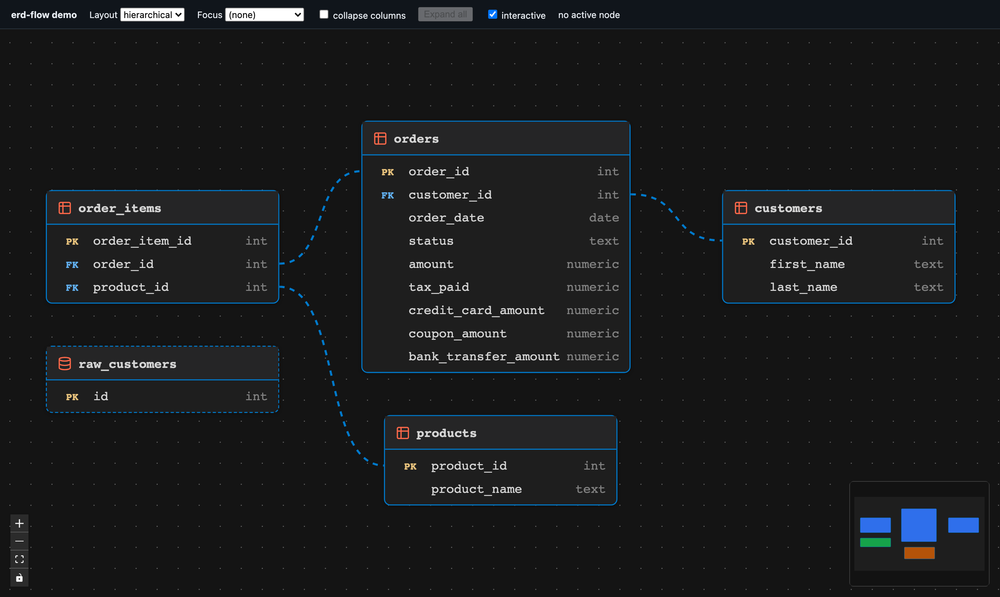

# @datnguye/erd-flow

[](https://github.com/datnguye/erd-flow/actions/workflows/pr-ci.yml)
[](https://github.com/datnguye/erd-flow/actions/workflows/release.yml)
[](https://www.npmjs.com/package/@datnguye/erd-flow)
[](https://www.npmjs.com/package/@datnguye/erd-flow)
[](./LICENSE)
[](https://github.com/datnguye/erd-flow/stargazers)

A [React Flow](https://reactflow.dev) entity-relationship diagram for
dbt projects: table nodes with per-column PK/FK badges, self-drawing foreign-key
edges that land on the exact joined rows, and pluggable layouts (hierarchical,
radial, force). It renders the [dbterd](https://github.com/datnguye/dbterd)
`json`-target shape directly, so a host just hands it data and a couple of
callbacks — the graph owns no transport and no theme of its own.

It powers the ERD in both [dbt-docs](https://github.com/datnguye/dbt-docs) (a
static docs SPA) and [dbterd-vscode](https://github.com/datnguye/dbterd-vscode)
(a VS Code webview). Turns out one diagram is enough for two very different
homes.

## Demo



The repo ships a Vite playground wired to a sample dbt-style payload — the
fastest way to see the diagram move before writing a line of host code:

```bash
git clone https://github.com/datnguye/erd-flow
cd erd-flow
npm install
npm run dev
```

Open the printed URL at `/demo/index.html`. The toolbar switches layout
(hierarchical / radial / force), focuses a table's FK neighbourhood, toggles
column collapsing, and locks the canvas. The same knobs work as URL params for
sharable states: `?layout=hierarchical`, `?focus=<node-id>`, `?collapse=off`,
`?locked=on`.

## Install

```bash
npm install @datnguye/erd-flow
```

React, React DOM, `@xyflow/react`, and `@dagrejs/dagre` are **peer
dependencies** — the package externalizes them so your app owns their versions.

## Usage

```tsx
import { ErdFlow } from "@datnguye/erd-flow";
import "@datnguye/erd-flow/styles.css";

export function Diagram({ payload }) {
  return (
    <div style={{ width: "100%", height: "100vh" }}>
      <ErdFlow
        data={payload}
        layout="radial"
        onOpenNode={(node) => open(node.model_path)}
        onNodeActivate={(node) => setDetails(node)}
        labelFor={(node) => node.name}
      />
    </div>
  );
}
```

`ErdFlow` fills its parent, so give the parent an explicit size.

## Props

| Prop | Type | Notes |
|---|---|---|
| `data` | `ErdPayload` | The nodes/edges to render (dbterd-native shape). |
| `layout` / `defaultLayout` | `string` | Controlled or initial layout — a built-in (`"hierarchical" \| "radial" \| "force"`) or a name added via `registerLayout`. Unknown names fall back to the default. |
| `estimateSize` | `(node, visibleColumns, hasToggle) => { width, height }` | Override the layout-box estimate when your CSS changes the card geometry. |
| `filter` | `string` | Highlights matching tables, dims the rest — never removes them. |
| `hideUnconnected` | `boolean` | Drops zero-edge island tables. |
| `focus` / `focusDepth` | `string` / `number` | Render only a node's FK neighbourhood. |
| `compact` | `boolean` | Show only key (PK/FK) columns per table. |
| `collapseColumns` | `boolean` | Collapse wide tables to a few rows with a "N more" toggle (default `true`). `false` shows every column — for a focused view where join columns must stay visible. |
| `expandAll` | `boolean` | Controlled expand-all: forces every collapsible table open (`true`) or closed (`false`). Omit to let per-table toggles work independently. |
| `onExpandStateChange` | `({ allExpanded, canExpand }) => void` | Reports the aggregate expand state so a host can label/disable its own expand-all button. |
| `interactive` | `boolean` | Pan / zoom / drag (default `true`). `false` locks the canvas and releases the wheel so the page scrolls past it — gate it behind a "click to unlock" affordance. |
| `onNodeActivate` | `(node \| null) => void` | Header click activates; pane click clears. Render your own details pane. |
| `onOpenNode` | `(node) => void` | Table double-click — open the backing model. |
| `resourceMeta` | `Record<string, ResourceMeta>` | Colour/icon per `resource_type`. Merged over dbt defaults. |
| `labelFor` | `(node) => string` | Display label; defaults to `node.name`. |
| `theme` | `ErdTheme` | CSS-var overrides (see below). |
| `colorMode` | `"light" \| "dark" \| "system"` | React Flow colour mode (default `"dark"`). |
| `minimap` / `controls` / `background` | `boolean` | Toggle the built-in chrome. |
| `showSchema` | `boolean` | Render `schema_name` right-aligned in each table header (default `false`). |
| `compositeEdges` | `"bundle" \| "fan"` | Multi-column FK rendering: one bundled edge with per-column tails (default), or one independent edge per column pair. |
| `edgePath` | `"cubic" \| "smoothstep"` | Path shape for single-column edges (default `"cubic"`). |
| `animateEdge` | `(edge) => boolean` | Gate the marching-ants dash per edge; default animates every FK edge. |
| `dimOnSelect` | `boolean` | While an edge is selected, fade every other edge and non-endpoint node (default `false`). |
| `onlyRenderVisibleElements` | `boolean` | Mount only in-viewport nodes/edges — for very large uncapped ERDs (default `false`). |
| `fitViewOptions` | `FitViewOptions` | Padding / zoom clamps applied to the initial fit and every re-fit. |
| `refitKey` | `unknown` | Change it to request a re-fit (e.g. pass your fullscreen state). |
| `className` | `string` | Extra class name appended to the root element. |

## Custom layouts

Layouts are a name → engine registry. Register your own and select it by name —
the engine receives pre-sized nodes (see `estimateSize`) and only decides
placement:

```ts
import { registerLayout, type LayoutEngine } from "@datnguye/erd-flow";

const snowflake: LayoutEngine = (sized, edges, { centerId }) => {
  // return [{ id, x, y, dimensions: { width, height } }, ...]
};
registerLayout("snowflake", snowflake);

<ErdFlow data={data} layout="snowflake" />
```

## Theming

Every colour is a CSS custom property with a built-in fallback, so the default
is a usable dark ERD. Map your own tokens either via the `theme` prop or by
setting the `--erd-*` variables in CSS:

```css
.my-erd {
  --erd-node-bg: var(--vscode-editor-background);
  --erd-border: var(--vscode-focusBorder);
  --erd-accent: var(--vscode-charts-yellow);
}
```

Tokens: `--erd-node-bg`, `--erd-node-fg`, `--erd-border`, `--erd-accent`,
`--erd-fk`, `--erd-header-bg`, `--erd-hover-bg`, `--erd-muted-fg`,
`--erd-link-fg`, `--erd-divider`, `--erd-icon`, `--erd-font-mono`, `--erd-edge`,
`--erd-edge-selected`, `--erd-edge-width`, `--erd-edge-selected-width`,
`--erd-minimap-bg`, `--erd-minimap-dim`, `--erd-minimap-mask`, `--erd-shadow`.

## Data shape

The payload uses dbterd's native `json`-target field names — an edge's `from_id`
is the FK/child side, `to_id` the referenced/parent side:

```ts
interface ErdPayload {
  nodes: ErdNode[];   // { id, name, resource_type?, schema_name?, columns, ... }
  edges: ErdEdge[];   // { id, from_id, to_id, from_columns?, to_columns?, ... }
  metadata?: ErdMetadata;
}
```

`toFlowGraph`, `windowPayload`, `erdNeighborhood`, and `compactColumns` are
exported for hosts that want to pre-process the payload themselves.

## Development

```bash
npm install
npm run build       # tsc -b && vite build → dist/ (ESM + .d.ts + css)
npm test            # vitest
npm run typecheck
```

## License

MIT © Dat Nguyen
